## 数学基础

### 一、函数

给定一个数集A,对A施加一个对应的法则/映射f，记做：f(A)，那么可以得到另外一个数集B，也就是可以认为B=f(A)；那么这个关系就叫做函数关系式，简称函数。

三个重要的因素：定义域A、值域B、对应的映射法则f。

#### 1.1、常见函数

常函数：y = C

一次函数：y = ax + b

二次函数：y = ax2 + bx + c

幂函数：y = xa

指数函数：y = ax，a的取值范围：a > 0 & a != 1

对数函数：y = loga(x)，a的取值范围：a > 0 & a != 1

#### 1.2 、反函数

若函数f: D -> f(D)，它存在逆映射f-1(x)：f(D) -> D，则此映射f-1称为函数f的反函数。

反函数性质：

1. 函数f(x)与其反函数f-1(x)关于直线y = x对称.
2. 若f(x)是定义在D上的单调函数，则与其反函数f-1(x)存在，且f-1(x)也是单调函数，且单调性相同。

#### 1.3、复合函数

设函数y=f(u)的定义域为Du，值域为Mu，函数u=g(x）的定义域为Dx，值域为Mx，如果Mx∩Du≠Ø，那么对于Mx∩Du内的任意一个x经过u；有唯一确定的y值与之对应，则变量x与y之间通过变量u形成的一种函数关系，这种函数称为复合函数(composite function)，记为：y=f[g(x)]，其中x称为自变量，u为中间变量，y为因变量（即函数）。

#### 1.4、基本初等函数

1. 幂函数：y = xa（a是常数）

   必经(1,1)点

2. 指数函数：y = ax（a > 0, a != 1）

   必经(0,1)点，

3. 对数函数：y = loga(x)（a > 0, a != 1）

   必经(1,0)点，是指数函数的反函数

4. 三角函数
   1. 正弦函数：y = sin x，奇函数
   2. 余弦函数：y = cos x，偶函数
   3. 正切函数：y = tan x，奇函数，x != (2n + 1)π/2
   4. 余切函数：y = cot x，奇函数，x != nπ
   5. 正割函数：y = sec x = 1 / cos x
   6. 余割函数：y = csc x = 1 / sin x

5. 反三角函数

   1. 反正弦函数：y = arc sin x
   2. 反余弦函数：y = arc cos x
   3. 反正切函数：y = arc tan x
   4. 反余切函数：y = arc cot x

### 二、极限

#### 2.1、数列极限 ####
数列极限定义：设{xn}为一数列，若有常数a，对于任意给定的正数ε（无论多小），总存在正整数N,使当n > N时，不等式|xn - a| < ε恒成立，则称a是数列{xn}的极限或称{xn}收敛于a，记为：

xn -> a （n -> 无穷）

收敛数列的性质：

1. 如数列{xn}收敛，则它的极限唯一
2. 如数列{xn}收敛，则数列{xn}一定有界
3. 收敛数列的保号性，数列{xn}极限为a > 0，当n > N，有xn  > 0

#### 2.2、函数极限 ####

##### 2.2.1、函数极限定义

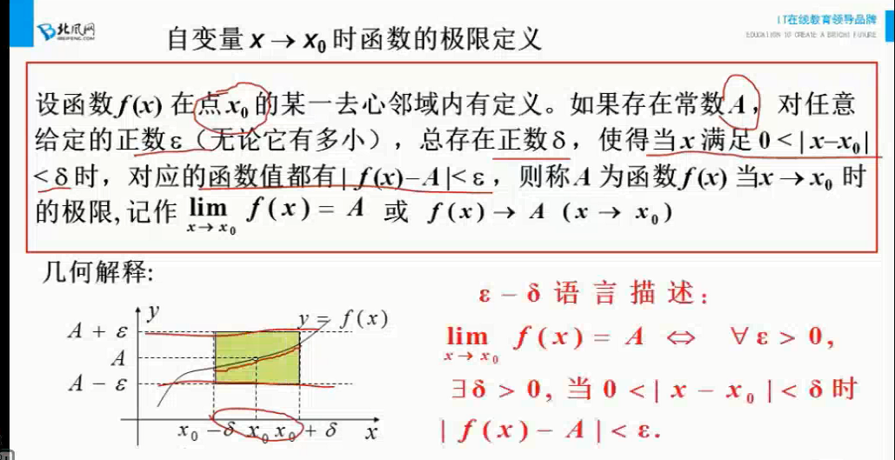

##### 2.2.2、左极限和右极限

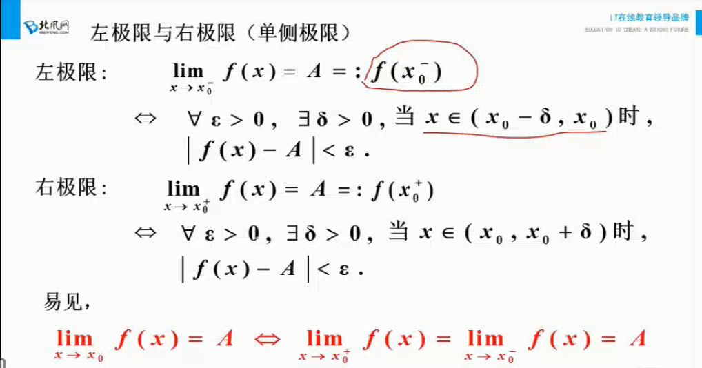

##### 2.2.3、函数极限的性质

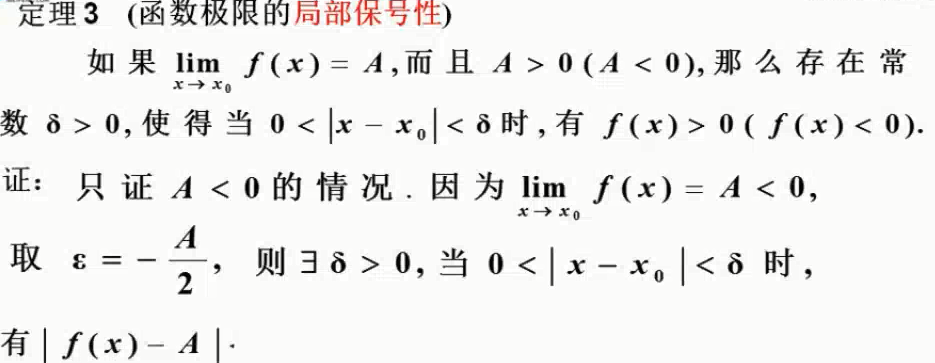

##### 2.2.4、极限存在的两个准则

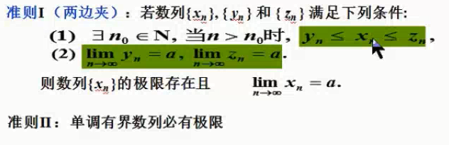

### 三、导数

#### 3.1、导数定义

#### 3.2、导数公式与基本求导法则

##### 3.2.1、常数和基本初等函数的导数公式

##### 3.2.2、函数的和、差、积、商的求导法则

##### 3.2.3、复合函数求导法则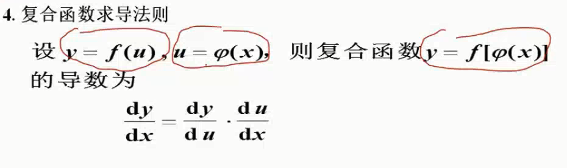

#### 3.3、高阶导数

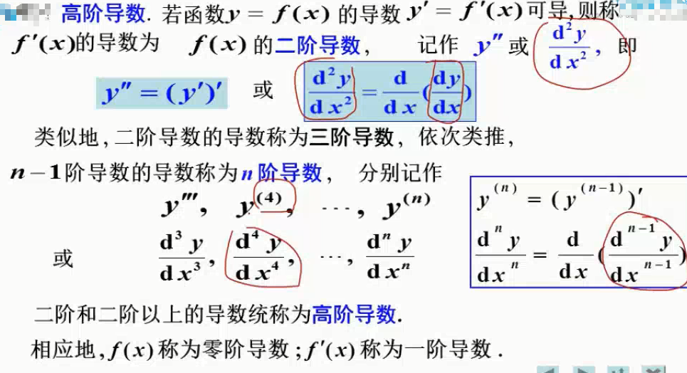

#### 3.4、导数的应用

##### 3.4.1、函数单调性

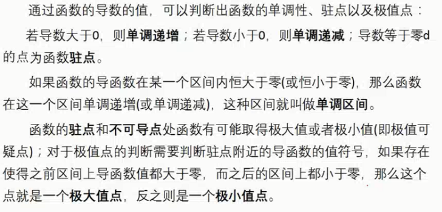

##### 3.4.2、曲线的凹凸性

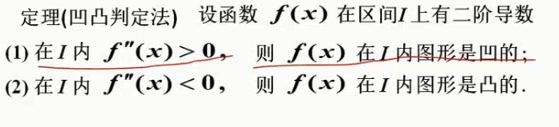

##### 3.4.3、函数极值和最值

###### 3.4.3.1、极值定义

导数等于零的点称为驻点

###### 3.4.3.2、极值存在的第一充分条件

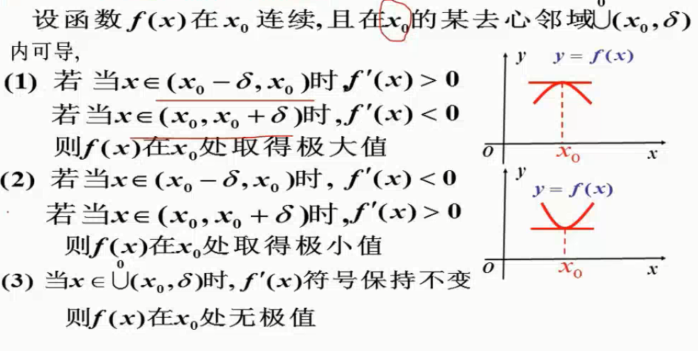

###### 3.4.3.3、极值存在的第二充分条件

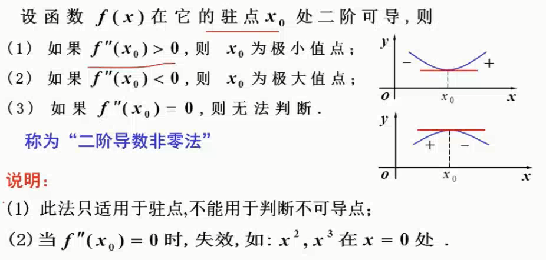

###### 3.4.3.4、求极值的步骤

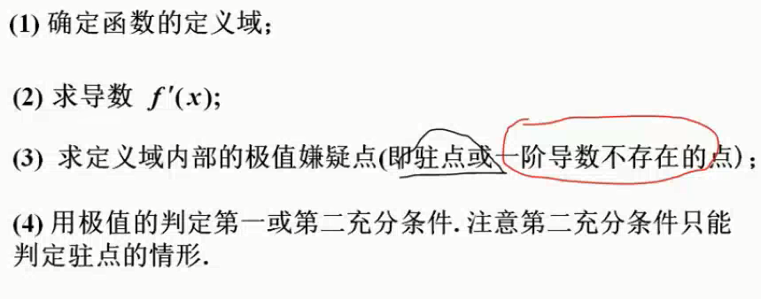